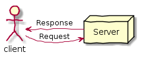
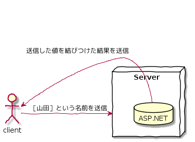
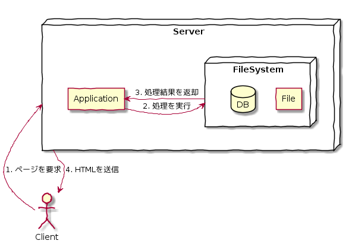

Day00
===

# ASP.NETとは？

- (一言で言うと)Webアプリケーションを開発するための技術

# クライアントとサーバ(概念の説明)

## クライアント
- *要求を行い、結果を受け取る*コンピュータのこと

## サーバ
- *情報やサービスを提供する*コンピュータのこと
  - 例: メールサーバ、データベースサーバ、Webサーバ等


# リクエストとレスポンス

- plantUMLで図を生成

```

@startuml
' 手書き風
skinparam handwritten true

' 役者
actor client
node Server

' 関係
client -right-> Server: Request
Server -left-> client: Response
@enduml

```




# 動的なページと静的なページ

```

@startuml
' 手書き風
	skinparam handwritten true
	
	' 役者
	actor client
	node Server{
		database ASP.NET
		}
	
	' 関係
	client -right-> Server: ［山田］という名前を送信
	ASP.NET -left-> client: 送信した値を結びつけた結果を送信
@enduml

```




# クライアントとサーバサイド

## クライアントサイドスクリプト
- クライアント側にスクリプトと必要なデータをダウンロードして，クライアント上で実行する。
- ※ データを保存できない(見せ方が違うだけ!)

## サーバサイド(ASP.NETはこっち)

- サーバ側で処理を行い、HTMLとして返却するもの

## イメージ図

```

@startuml
' 手書き風
skinparam handwritten true

' 役者
actor Client
node Server{
	agent Application
		node FileSystem{
			agent File
			database DB
		}
}

' 関係
Client -up-> Server: 1. ページを要求
Application -right-> FileSystem: 2. 処理を実行
FileSystem -left-> Application: 3. 処理結果を返却
Server -down-> Client: 4. HTMLを送信
@enduml

```



- 両者の大きな違いは、見せかけだけ(クライアントサイド)なのか、それとも、本質的に変化しているのか(サーバサイド)

- 切り分けとして、「*簡単なものはクライアントサイドで実装*」、「*難しいものはサーバサイドで実装*」

# ASP.NETのポジション

- ASP.NETは、「*サーバサイド技術*」である。
  - 同列に、PHP,Java,CGIなどがある。

## ASP.NETのメリット

- 構成する製品がすべてMicrosoftの製品の為、MSDNですべての障害を参照することができる。
- Visual BasicやC#が書ければ、アプリケーションを作成することができる。

## 補足: .NET Framework

- .NET対応の言語(C#, Visual Basic)から、呼び出すことのできる枠組み
  - 例: ASP.NET, ADO.NET

## ASP.NETプログラミングに必要なもの

1. ブラウザ
1. IIS(Internet Information Service)
  - Windowsの標準的なサービス
1. .NETフレームワーク
1. データベースサーバ

[TOPへ](./index.md)  
