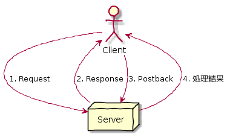
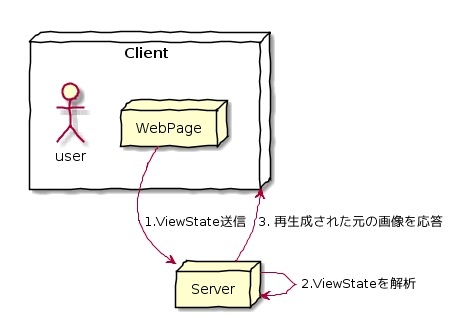
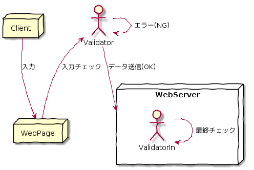

Day01-3
===

# 目的

- 検証コントロールの使用方法を学習する。

# ポストバック処理

## ポストバック処理に関してハンドリングされるイベントのタイミング

1. *Page\_PreInitイベント*
1. *Page\_Initイベント*
1. コントロールの初期化イベント
1. *Page\_Loadイベント*
1. 変更系イベント
1. クリック系イベント
1. *Page\_PreRenderイベント*
1. *Page\_Unloadイベント*

- *斜め文字*は、ポストバックイベント。
  - Page\_Loadが呼び出される。

### ポストバック時に実行したくない処理の記述方法

	If Not Page.IsPostback then
		' ポストバック時に実行したくない処理
		' (最初の呼び出し時のみに実行)
	EndIf

	@startuml
	' 手書き風
		skinparam handwritten true
		
		' 役者
		node Client{
		actor user
		node WebPage
		}
		node Server
		
		' 関係
		WebPage -> Server: 1.ViewState送信
		Server -> Server: 2.ViewStateを解析
		Server -> Client: 3. 再生成された元の画像を応答
	@enduml

# ビューステートを利用する

- ViewStateとは、ポストバック前後でページの\[State(状態)\］を維持するための仕組み

## 例

- HTML内に記述された隠しフィールド

	<input type="hidden" name="_VIEWSTATE" id="_VIEWSTATE" value="sGhnOwaGjoirgojgjaeojlabheiobReJwaoe" />

#### ビューステートのイメージ図

	@startuml
	' 手書き風
			skinparam handwritten true
			
			' 役者
			node Client{
			actor user
			node WebPage
			}
			node Server
			
			' 関係
			WebPage -> Server: 1.ViewState送信
			Server -> Server: 2.ViewStateを解析
			Server -> Client: 3. 再生成された元の画像を応答
	@enduml

- 

#### 構文

- `ViewState(名前)\[=値\]`
  - ※ ViewStateで保持されるのは、同一ページ内で行われたポストバックの前後のみ

# ユーザ入力の妥当性を検証する

- 妥当性検証=FoolProof -> 検証コントロールにより実現

@startuml
' 手書き風
	skinparam handwritten true

	' 役者
	node Client
	node WebPage
	node WebServer{
        actor ValidatorIn
        }
	actor Validator

	' 関係
	Client -> WebPage: 入力
	Validator <- WebPage: 入力チェック
        Validator -> Validator: エラー(NG)
        Validator -> WebServer: データ送信(OK)
        ValidatorIn -> ValidatorIn: 最終チェック
@enduml

- 

## ASP.NET 3.5で利用可能な検証コントロール

1. RequiredFieldValidar: 必須チェック(フォームへの入力の有無を確認)
1. RangeValidator: データ範囲チェック(数値や日付などの上限/下限を確認)
1. CompareValidator: 比較チェック(コントロール同士、またはコントロールと特定の値とを比較し、等号/不等号, 大小関係, データ型などを確認)
1. RegularExpressionValidator: 正規表現チェック
1. CustomValidator: カスタムの検証チェック
1. ValidationSummary: 検証コントロールのサマリ表示

### 検証コントロールの共通プロパティ

#### 挙動

- ControlToValidate: 検証対象となるサーバーコントロールのID値
- EnableClientScript: クライアント側の検証を有効にするかどうか(True/False)
- Enabled: 検証コントロールそのものを有効にするかどうか(True/False)
- SetFocusOnError: エラー時に検証対象のコントロールにフォーカスをセットするかどうか(True/False)
- ValidationGroup: 検証コントロールが属する検証グループ

#### 表示

プロパティ名| 内容
------------|---------------------
Display| エラーメッセージの表示方法(None , Static , Dynamic)
ForeColor| エラーメッセージの表示色
ErrorMessage| 検証失敗時に表示するエラーメッセージ
Text| 検証失敗時に表示するテキスト

#### その他

- isValid: 検証が成功したかどうか(Readonly)

#### プロパティに関する補足

##### ErrorMessage/Textプロパティについて

- ErrorMessage: ValidationSummaryコントロールに引き渡すためのメッセージ
- Text: 検証コントロール自身に表示するためのテキスト -> 視覚的に場所を示すための目印

##### Enabled/EnabledClientScriptプロパティ

- Enabled: サーバサイドでのチェック処理
  - PHPとかで実装する側
- EnabledClientScript: クライアントサイドでのチェック処理(JS)
  - JavaScriptとかで実装する側

##### ValidationGroupプロパティ

- ValidationGroupに値を設定すると、ValidationGroupに属する検証コントロールだけが実行される。

# LabelコントロールとLiteralコントロール

- Labelコントロール: 修飾可能
- Literalコントロール: 修飾不可

# まとめ

Page\_Loadイベントは、ロード時だけでなく、*ポストバック時にも実行される。*
ポストバック処理かどうかは、*`Page.isPostback`で取得可能。*
ViewStateは、*状態を保持する仕組み*
Validationコントロールを利用することで、定型的な*入力値検証をコーディングレスで実装可能!*

以上

[TOPへ](./index.md)  
