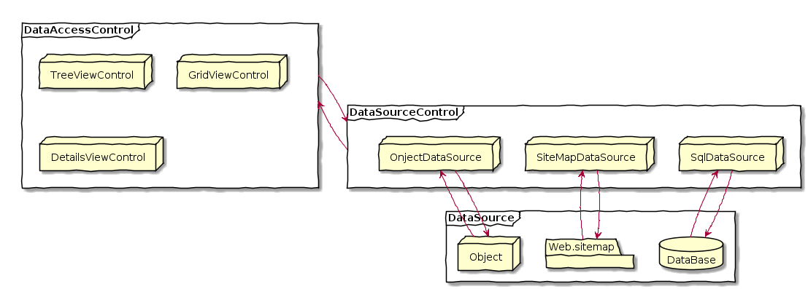

Day02-1
===

# 目的

- アプリ共通のメニュー/レイアウトを作成する方法を学習する。

## ナビゲーションコントロール

### TreeViewコントロール

- ツリー形式

	C:.
	└─sqldeveloper
	    ├─configuration
	    └─dataminer
	       ├─demos
	       │  └─workflows
	       └─scripts

### Menuコントロール

リッチメニュー

	home> day01
				day02> 01
				day03  02
							 03

### SiteMapPath

- パンくずリスト

[home](./index.md) > day02 > [01](./Day02-1.md)

## サイトマップの定義の仕方

- XMLファイルで定義する。

### サンプルコード

	<?xml version="1.0" encoding="utf-8"?>
	<siteMap xmlns="http://schemas.microsoft.com/AspNet/SiteMap-File-1.0">
		<siteMapNode url="~/Default.aspx" title="ホーム"
		description="10日でおぼえるASP.NET入門教室">
			<siteMapNode url="~/Day01.aspx" title="一日目"
			description="ASP.NETの基本的なしくみを覚えよう">
				<siteMapNode url="~/Day01.aspx" title="1時限目"
				description="おぼえよう ASP.NET 基本のキ"/>
				<siteMapNode url="~/Day01/Hello.aspx" title="2時限目"
				description="ファイルアップロードを実装しよう。"/>
				<siteMapNode url="~/Day01/Game.aspx" title="3時限目"
				description="数当てゲームを作成しよう。"/>
			</siteMapNode>
		</siteMapNode>

### 概要

	<siteMap> Web.sitemapの最上位要素
	│
	├<siteMapNode>
	│
	├<siteMapNode>
	│
	├<siteMapNode>
	│
	└<siteMapNode>
	  │
	  ├<siteMapNode>
	  │
	  ├<siteMapNode>
	  │
	  └<siteMapNode>

- siteMapNode内で、タイトル、URL等の要素は完結

項目名|内容
------|-----
url|メニューのURL
title|メニュータイトル
description|メニューの概要

## データソースコントロールを理解する

### 概要

- データソースにアクセスするためのサーバコントロールの総称

#### イメージ図

	@startuml
	
	' 手書き風
	skinparam handwritten true
	
	' 役者
	
	frame DataAccessControl{
		node TreeViewControl
		node GridViewControl
		node DetailsViewControl
	}
	
	frame DataSourceControl{
		node SqlDataSource
		node SiteMapDataSource
		node OnjectDataSource
	}
	
	frame DataSource{
		database DataBase
		folder Web.sitemap
		node Object
	}
	
	' 関係
	DataAccessControl --down-> DataSourceControl
	DataAccessControl <--up- DataSourceControl
	
	SqlDataSource -down-> DataBase
	SqlDataSource <-up- DataBase
	
	SiteMapDataSource -down-> Web.sitemap
	SiteMapDataSource <-up- Web.sitemap
	
	OnjectDataSource -down-> Object
	OnjectDataSource <-up- Object
	
	@enduml

### データソースコントロールに関する解説

#### TreeViewコントロール

- SiteMapDataSourceコントロールで、SiteMapをバインドするだけでツリー形式のメニューを生成してくれる。

##### スタイル

プロパティ名|内容
------------|-----
HoverNodeStyle|マウスポインタが置かれている場合のノードの外観
LeafNodeStyle|配下にサブメニューを持たないノードの外観
NodeStyle|ノードのデフォルトの外観
ParentNodeStyle|親ノードの外観
RootNodeStyle|ルートノードの外観
SelectedNodeStyle|選択されたノードの外観

##### 画像

プロパティ名|内容
------------|-----
CollapseImageToolTip|折り畳み可能なインジケータ画像のツールヒント
CollapseImageUrl|折り畳み可能なインジケータ画像のURL
ExpandImageToolTip|展開可能なインジケータ画像のツールヒント
ExpandImageUrl|展開可能なインジケータ画像のURL
NoExpandImageUrl|展開不可なインジケータ画像のURL

##### 挙動

プロパティ名|内容
------------|-----
ExpandDepth|デフォルトで展開されるレベル数
MAxDataBidDepth|TreeViewコントロールにバインドされるツリーレベルの最大数
NodeIndent|子ノードのインデント幅
NodeWrap|表示幅が不足している場合にノードテキストを折り返すか
ShowCheckBoxes|チェックボックスを表示するノードの種類(Root, Parent, Leaf, All, None)
ShowExpandCollapse|インジケータを表示するかどうか
Target|リンクターゲット

# まとめ

ナビゲーションコントロールを利用することで、ツリーメニューやパンくずリストのような典型的なナビゲーションをコーディングレスで作成できる。
ナビゲーションコントロールを利用するには、あらかじめ*サイトマップファイル*でサイトの構造情報を定義しておく必要がある。
サイトマップファイルは`<siteMapNode>`要素1つで、メニュー1項目を表現する。
*データソースコントロール*は、*データソース*と*サーバコントロール*との間の*仲介役*である。

以上

[TOPへ](./index.md)  
