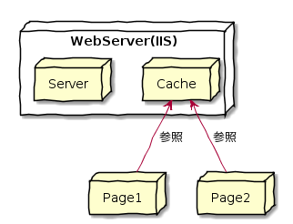
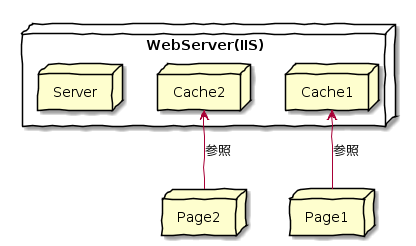

Day04-1
=======

# 目的

- `MultiView`コントロールで一覧/詳細マルチページを作成しよう

## このレッスンのねらい

- `MultiView`コントロールで、一つのページ上で複数のビューを切り替えて表示するためのコントロール

## MultiViewコントロールによるマルチビューの作成

- `MultiView`コントロール配下に、`View`コントロールを配置することで複数のビューを切り替えて表示することが可能である。

###  ActiveViewIndexプロパティを指定する3つの方法を紹介

#### プロパティウィンドウから設定(静的な設定)

- `MultiView`コントロールの`ActiveViewIndex`プロパティ

#### コードから設定(動的な設定)

- `SelectedIndexChanged`イベントハンドラの中に下記のコードを記述する。

	Protected Sub grid_SelectedIndexChanged(ByVal sender As object, ByVal e As System.EventArgs)
	  mv.ActiveViewIndex=1
	End Sub

#### コマンドボタンとして設定(動的な設定)

- やや特殊な切り替えの手段として、ボタンコントロール(Button, LikButton, ImageButton)のコマンドを使用する方法がある。
  - ボタンコントロールには、ボタンに特殊な機能を付与するための`CommandName`プロパティ(コマンド名)、  
	`CommandArgument`プロパティ(コマンドを実行する際に使用する引数)が用意されている。
	- `Multiview`コントロールでは、これらのプロパティに対してあらかじめ予約された値をセットすることで、コーディングレスでビューの切り替えを行うことができる。

##### MultiViewコントロール内で利用可能なコマンド

CommandName|CommandArgument|概要
-----------|---------------|----
NextView|-|次のビューに移動
PrevView|-|前のビューに移動
SwitchViewByID|切り替え先のViewのID値|指定ビューに移動
SwitchViewByIndex|切り替え先のViewのインデックス|指定ビューに移動

## 選択パラメータを動的に引き渡す

### SalDataSourceコントロール

- SELECT命令などのSQLコマンドに動的にパラメータを引き渡すことができる。

#### SqlDataSourceコントロールで利用可能なパラメータソース

ソース|使用できるパラメータ値
------|----------------------
Control|サーバコントロールのプロパティ値
Profile|プロファイルのプロパティ値
Session|セッション情報
Cookie|クッキー値
Form|ポストデータ(`<form method="POST">`から送信される情報)
QueryString|クエリ情報(`?name=value`の形式で渡される情報)

## データベース連携の負荷を軽減

- データベース連携は、大きな処理である。
- SqlDataSourceコントロールは、データベースへの接続方法はデータの取得方法を変更することで、最適なデータベース連携を実現する手段を提供している。

### DataSourceModeプロパティでデータの取得モードを指定する

- `DataSourceMode`プロパティは、`SqlDataSource`コントロールがデータベースからデータを取得する際の取得モードを指定する。
- `DataSet`か`DataReader`かのいずれかを指定することができる。
  - `DataSet`の方が重いので、高度な機能を利用しない場合は`DataReader`を選択すること

プロパティ|リソース|特徴
----------|--------|----
DataSet|多|`DataSet`オブジェクトを利用する。 リッチ
DataReader|少|`DataReader`オブジェクトを利用する。 軽量

## データをキャッシュする

- `SqlDataSource`コントロールでは、取得したデータをキャッシュするための機能が提供されている。

### キャッシュ

- 取得したデータを一旦メモリなどに保持することによって、  
- 以降のアクセス時に同じデータが要求された場合にもメモリから直接データを取得することでアクセス効率を高める手法

#### SqlDataSourceコントロールのキャッシュ関連プロパティ

プロパティ|概要
----------|----
EnableCaching|データキャッシュ機能を有効にするか(True,False)
CadheDuration|キャッシュの有効期限(秒)
CacheExpirationPolicy|有効期限の基点(Absolute,Sliding)

##### CacheExpirationPolicyプロパティについて

- プロパティ値が`Absolute`の場合には、キャッシュデータが*最初に作成された時点*から有効期限をカウントする。
- プロパティ値が`Sliding`の場合には、キャッシュが*最後にアクセスされた時点*から有効期限が変動する。

## ページキャッシュを利用する

- ASP.NETでは、`@OutputCache`ディレクティヴを利用することで、*ページ全体に対してキャッシュを有効にすること*ができる。

### コード

- 下記のコードをページの先頭部で宣言する。

	<%@ Page Language="VB" %>
	<%@ OutputCache Duration="120" VaryByParam="*" %>

- この場合、キャッシュデータは*120秒*だけキャッシュされる。
- `VaryByParam`属性は、ページキャッシュを識別するためのキーとなるリクエストパラメータのキーとなるもの。
  - リクエストパラメータなどによって変動する出力を個々に*異なるキャッシュデータ*として保存することが可能 => *Dynamic Output Caching*

- 例えば、`quest.aspx?id=ABC123&category=ASPNET`のようなクエリ情報でページの内容が変動するときには  
下記の様に記述することで、`id`,`category`パラメータの単位にキャッシュが生成されるようになる。

	<%@ OutputCache Duration="120" VaryByParam="id;category" %>

- ※ すべてのパラメータでキャッシュを識別したい場合、`VaryByParam="*"`とする

	@startuml
	' 手書き風
	skinparam handwritten true
	
	' 役者
	node WebServer(IIS){
		node Cache
			node Server
	}
	
	node Page1
	node Page2
	
	
	' 関係
	Page1 -up-> Cache: 参照
	Page2 -up-> Cache: 参照
	@enduml

- 異なるパラメータでも同じURLならば、ひとつのキャッシュに保存
  - -> 動的なページが適切に復帰できない。

	@startuml
	' 手書き風
			skinparam handwritten true
			
			' 役者
			node WebServer(IIS){
	node Cache1
	node Cache2
	node Server
	}
	
	node Page1
	node Page2
	
			
			' 関係
			Page1 -up-> Cache1: 参照
			Page2 -up-> Cache2: 参照
	@enduml

- 同じURLでも異なるパラメータならば、別々のキャッシュに保存

### @OutputCacheディレクティヴの主な属性(\*がついているものは必須)

属性|概要
----|----
DiskCachable|キャッシュをディスクに保存するか
Duration|キャッシュの有効期限(秒)
Location|キャッシュの格納先
Shared|フラグメントキャッシュを複数ページで共有するか
VaryByHeader|フラグメントキャッシュを複数ページで共有するか
VaryByParam|キャッシュを切り替えるキーとなるリクエストパラメータのリスト(セミコロン区切り)
VaryByControl|キャッシュを切り替えるためのキーとなるコントロールのIDのリスト(セミコロン区切り)

### CacheProfile属性

- `web.config`ファイルにキャッシュポリシーを定義することができる 。

	<cadhing>
	  <outputCacheSetting>
		  <outputCacheProfiles>
			  <add name="MyCache" enabled="true" duration="120"
				  location="Any" VeryByParam="*" />
			</outputCacheProfiles>
	  </outputCacheSetting>
	<\cadhing>

- 個々のページでは次のようにして、キャッシュポリシーを指定する。

	<%@ OutputCache CacheProfile="MyCache" %>

## DetailsViewコントロールの主なプロパティ

- `DetailsView`コントロールは個々の単票を作成するためのコントロール

### 表示

プロパティ|概要
----------|----
Caption|キャプション
CaptionAlign|キャプションの配置
EmptyDataText|データがない場合に表示するテキスト
GridLines|グリッド線の表示方法
HeaderText|ヘッダテキスト
FooterText|フッタテキスト
HorizontalAlign|水平方向の配置
PagerSettings|ページング機能を有効にするか

### 挙動

プロパティ|概要
----------|----
AllowPaging|ページング機能を有効にするか
CurrentMode|現在のモード
DefaultMode|デフォルトモード

### 情報

プロパティ|概要
----------|----
PageCount|レコード総数
PageIndex|現在のページ番号
SelectedValue|カレントレコードの主キー値
DataKeyNames|主キーを表すフィールド名

### スタイル

プロパティ|概要
----------|----
TopPagerRow|ページャの外観(上部)
HeaderStyle|ヘッダ行の外観
FieldHeaderStyle|項目ヘッダの外観
RowStyle|データ行の外観(参照モード)
AltermatingRowStyle|交互に表示されるデータ行
EditRowStyle|データ行の外観(編集モード)
InsertRowStyle|データ行の外観(挿入モード)
CommandRowStyle|コマンド行の外観
PagerStyle|ページャの外観
FooterStyle|フッタの外観
EmptyDataRowStyle|データが空である場合の外観

## まとめ

- `MultiView`コントロールは、1つのページ内で複数のビューを切り替え表示するためのコントロール
  - `View`コントロールとセットで使用する。
- `MultiView`コントロールの表示ビューを切り替えるには、`ActiveViewIndex`プロパティを指定する。
- `ActiveViewIndex`プロパティを切り替える方法には下記の3つがある。
  1. 静的に指定する方法
	1. コードから動的に指定する方法
	1. コマンドボタンで指定する方法
- `SqlDataSource`コントロールには動的にパラメータ値を引き渡すことができる。
  - サーバコントロールのプロパティ値
	- プロファイル値
	- セッション情報
	- クッキー情報
- ASP.NETでは、ページキャッシュやデータキャッシュなど、さまざまなキャッシュの仕組みを提供する。
  - データ更新がないようなコンテンツについては、キャッシュ機能を利用することで効率的に取得できる。

以上

[TOP](./index.md)  
