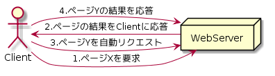
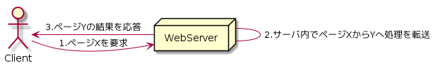

Day05-2
===

# 概要

- `FromView`コントロールでスケジュール情報を更新しよう!

## このレッスンの狙い

- [第四日目](./Day04-1.md)のレッスンで学んだ、`DetailsView`コントロールは、ウィザード操作とプロパティ設定だけで手軽にビューを生成できるが、  
*自由度*に欠ける。
- 単票ビューでより自由なレイアウトを作成したい場合には、`FormView`コントロールを利用する。

## クエリ文字列を`SqlDataSource`コントロールに引き渡す

### クエリ文字列(URLパラメータ)

- URLの末尾[?~]以降に付加された`キー名=値`のセットのこと
  - `&`で連結可能

```クエリ文字列の例

~/Details.aspx?sid=123&sdate=20180601

```

- 以下のような注意が必要
  - データサイズに一定の制約がある。
  - 「?」「&」「%」、空白、マルチバイト文字などは使用できない。
  - データがアドレス欄に露出する。

## `FormView`コントロール

### `FormView`コントロールと`Detailview`コントロールの違い

- `FormView`コントロール
  - より柔軟な自前レイアウト
- `Detailview`コントロール
  - 比較的決まりきったテーブル形式のレイアウト

#### FormViewコントロールで利用可能なテンプレート

テンプレート|概要
------------|----
ItemTemplate|個別アイテムの表示
FotterTemplate|フッタ部分
EditItemTemplate|個別アイテムの更新
HeaderTemplate|ヘッダ部分
InsertItemTemplate|個別アイテムの新規登録
EmptyDataTemplate|データが存在しない場合の表示
PagerTemplate|ページャ部分

- なお、`FormView`コントロールでは、ボタンに特殊な機能を持たせるために  
`CommandName`/`CommandArgument`プロパティの値が予約されている。
- ボタンコントロールやこれらのプロパティに対して予約コマンドを設定しておくことで、基本的な挿入や更新  
ページングなどの操作をコーディングすることなく、実現することができる。

##### `FormView`コントロールで利用可能な`CommandName`/`CommandArgument`プロパティ

CommandName|CommandArgument|概要
-----------|---------------|----
New|-|[新規操作]ボタン
Insert|-|[挿入]ボタン
Delete|-|[削除]ボタン
Edit|-|[編集]ボタン
Update|-|[更新]ボタン
Cancel|-|[キャンセル]ボタン
Page|Next|次のページへ移動
Page|Prev|前のページへ移動
Page|First|最初のページへ移動
Page|Last|最後のページへ移動

## `FormView`コントロールの`ItemXxxxxing`/`ItemXxxxxed`イベント

### `ItemXxxxxing`イベント

```VB.NET: ItemXxxxxingのサンプルコード

Protected Sub fv_ItemInserting(ByVal sender As Object, ByVal e As System.Web.UI.WebControls.FormViewInsertEventArgs)
  If Not Page.IsValid Then
	  e.Cancel = True
	End If
End Sub

```

#### 解説

- `ItemXxxxxing`イベントは、挿入/更新/削除の各処理を完了する[直前]に発生するイベントで  
検証結果に応じて処理をキャンセルしたり、データソースコントロールに対してパラメータを動的に設定したりする目的で使用する。 
- `Page.IsValid`プロパティを使用して、詳細ビュー上の検証処理が成功したかどうかを判定
  - 検証処理が失敗した場合はには挿入処理をキャンセルする。
	  - `Cancel`プロパティを`True`に設定する。

### `ItemXxxxxed`イベント

``` VB.NET: ItemXxxxxedのサンプルコード

Protected Sub fv_ItemInserted(ByVal sender As Object, ByVal e As System.WebControls.FormViewInsertedEventArgs)
  Response.Redirect("Calender.aspx")
End Sub

```

#### 解説

- `ItemXxxxxing`イベントは、挿入/更新/削除の各処理を完了する[直後]に発生するイベントで  
処理結果を取得し、画面に表示したり、処理後の画面遷移などを定義することが可能になる。
- `Responce.Redirect`メソッドは、指定されたパスにリダイレクト(移動)するための命令。

### 参考: データソースコントロールにプログラムから値をバインド

```VB.NET: データソースコントロールへの値の引き渡し

Protected Sub fv_ItemInserting(ByVal sender As Object, ByVal e As System.Web.UI.WebControls.FormViewInsertEventArgs)
  If Page.IsValid Then
	  Dim subject As TextBox = DirectCast(fv.FindControl("txtSubject"), TextBox)
	  Dim sdate As TextBox = DirectCast(fv.FindControl("txtSdate"), TextBox)
	  Dim stime As TextBox = DirectCast(fv.FindControl("txtStime"), TextBox)
		e.Values("subject") = subject.Text
		e.Values("sdate") = sdate.Text
		e.Values("stime") = stime.Text
	Else
	  e.Cancel = True
	End If
End Sub

```

#### 解説

- `FormView`コントロール内に配置されたサーバコントロールを取得するには、`FindControl`メソッドを使用する。
  - `FindControl`メソッドの返り値は、`Control`型なので、`DirectCast`命令で、適切な型にキャストする。
- そのあとで、`FormViewInsertEventArgs`オブジェクトの`NewValues`プロパティを介して、データソースに定義されたパラメータに  
対応するコントロールの値をセットする。
- 入力された値をプログラム側で加工した上で、データソースに引き渡したいという場合には、例のように`ItemInserting`イベントを利用する。

## リダイレクトと転送との違い

- `Response.Redirect`メソッドはプログラム所から強制的に移動するための命令である。
- よく似た操作として`転送`がある。

```VB.NET:転送の例

Protected Sub fv_ItemInserted(ByVal sender As Object, ByVal e As System.Web.UI.WebControls.FormViewInsertedEventArgs)
  Server.Transfer("Calendar.aspx")
End Sub

```

- 挙動としては同じだが、内部的には全く異なるものなので注意すること。

### リダイレクト

```

@startuml
Actor Client
Node WebServer

Client -> WebServer:1.ページXを要求
Client <- WebServer:2.ページの結果をClientに応答
Client -> WebServer:3.ページYを自動リクエスト
Client -> WebServer:4.ページYの結果を応答
@enduml

```



### 転送

```

@startuml
Actor Client
Node WebServer

Client -> WebServer:1.ページXを要求
WebServer - WebServer:2.サーバ内でページXからYへ処理を転送
Client <- WebServer:3.ページYの結果を応答
@enduml

```




### 解説

- リダイレクトはいったんレスポンスをクライアントに返した上で、自動的にサーバにリクエストを発信させる仕組みである。
  - 内部的にはサーバ/クライアント間で通信の行き来が2往復発生している。
- 転送はサーバ名で処理を異なるページに転送する仕組み
  - サーバ/クライアント間の処理は一回しか発生しない。

- その結果、以下のような違いが発生する。

#### 転送の方がリダイレクトよりも高いパフォーマンスが望める

- 理由はリダイレクトの方が、サーバ/クライアント間の通信の回数が多いから*だけではない*
  - リダイレクトにより発生した2回目のリクエストはサーバ側で待ち行列の末尾に配置される。
	- トラフィック(情報量)の多いサーバにおいては、要求待ちによる遅延も発生し得る。

#### リクエスト情報を引き継げるのは、*転送*のみ

- リクエスト情報: ポストデータやクエリ情報、ビューステートなどの情報のこと
- 内部的には、「2つの」リクエストであるリダイレクトの前後では、これらのリクエスト情報を引き継ぐことはできない。

#### 転送を利用できるのは、サーバ内のページ間のみ

- 転送はその性質上、サーバ内部でのページ間でしか利用することができない。
  - 外部のサーバに移動する必要がある場合には、リダイレクトを使用する必要がある!

## まとめ

- クエリ文字列を利用することで、ページ間でのちょっとした情報のやり取りを簡単に行うことができる。
- `DetailsView`コントロールと同様、詳細ビューを作成するためにはコントロールとして`FormView`コントロールがある。
  - `FormView`コントロールは、`DeatailsView`コントロールに比べ、より柔軟なレイアウトをしてできるのが特徴である。
- `FormView`コントロールの、`ItemXxxxxing`イベント、`ItemXxxxxed`イベントを利用することで、処理前後に自前の処理を埋め込むことができる。
- ページを強制的に移動する手段として、リダイレクトと転送がある。
   
以上

[TOPへ](./index.md)  
