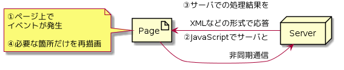

Day09-1
===

# 概要

- UpdatePanel + Timerコントロールで自動更新ページを生成しよう。

## このレッスンの狙い

- Ajax技術をASP.NETアプリケーションに組み込む方法について学習する。

## Ajax

- `Ajax` = Asynchronous JavaScript + Xml
- 簡単に言えば、デスクトップアプリケーションのようなリッチな表現をブラウザ上で可能にする技術
  - `JavaScript`を利用してサーバ側と非同期通信を行い受け取った結果を`DoM`(Document Object Model)などの技術を使ってページに反映させる仕組み

### 従来のアプリケーションの挙動

```

@startuml
artifact Page
note left: ①ページ上で\r\nイベントが発生\r\n\r\n④ページ全体を再描画
node Server

Page -> Server: ②サーバに要求データを送信
Server -> Page: ③サーバでの処理結果を\r\nHTML形式で応答
@enduml

```

<<<<<<< HEAD

=======

>>>>>>> f76bb0ad9f326b3c20bd4028a156fd8c8eb4e44d

### Ajaxアプリケーションの挙動

```

@startuml
artifact Page
note left: ①ページ上で\r\nイベントが発生\r\n\r\n④必要な箇所だけを再描画
node Server

Page -> Server: ②JavaScriptでサーバと\r\n非同期通信
Server -> Page: ③サーバでの処理結果を\r\nXMLなどの形式で応答
@enduml

```

<<<<<<< HEAD

=======

>>>>>>> f76bb0ad9f326b3c20bd4028a156fd8c8eb4e44d

#### 解説

- 従来の処理は、ユーザはサーバ処理を要求するたびにその勝利結果を待たなければならない。(*同期通信*)
- Ajax技術を利用することで、エンドユーザはサーバ処理の間も手元の操作を継続できる。(*非同期通信*)
  - 実際に変更されたページの断片だけを部分的に更新するため従来型のアプリケーションにありがちなちらつきを抑えることができる。

#### 問題点

- サーバのエンジニアは、JavaScriptは複雑な処理を書くことに抵抗がある。
- クロスブラウザ問題(ブラウザ間の統一性の話)がある。
  - JavaScriptによるコーディングを最小限に抑えるライブラリを使用する。

## ASP.NET3.5で標準搭載されたAJAXライブラリ(AJAX Extensions)

- ASP.NET3.5ではAsP.NET AJAXが標準搭載されたことで、ASP.NET本体のインストールのみでAJAX対応アプリケーションが構築できるようになった。
- サーバサイド機能を提供するライブラリで、主にサーバサイドで動作するサーバコントロールを提供する。

### AJAX Extensionsで提供されるサーバコントロール

- AJAX Extensionsで提供されるサーバコントロール

コントロール|概要
ScriptManager|Ajax機能の動作に必要なJavaScriptのコードを管理
ScriptManagerProxy|マスタページ対応版の`ScriptManager`コントロール
UpdatePanel|部分的な更新に対応したパネルを定義
Timer|一定時間おきに任意の処理を実行するタイマ機能を実装
UpdateProgress|非同期通信中に[通信中]メッセージや画像を表示

#### `ScriptManager` コントロール

- ASP.NET AJAX の動作に必要なJavaScriptの出力/生成などを管理するためのコントロール
- ASP.NET AJAXを利用するためには、*[ページの先頭に一つだけ配置する]*必要がある。
  - 本来は、aspxファイルの先頭に配置する必要があるが、マスタページを利用している場合はマスタページの先頭に配置する必要がる。

#### `UpdatePanel` コントロール

- ページの中の指定された領域だけを部分的に更新するためのコントロール。
- ユーザコントロールAdRotator.ascxとLabelコントロールに配置することで広告バナーとラベルだけを更新できるようにする。

##### (1) `UpdatePanel`コントロールの中でポストバックが発生した場合

- 例えば、`UpdatePanel`コントロールの中に`Button`コントロールを配置し、ボタンクリックしたタイミングで`UpdatePanel`配下の領域が部分更新されることが確認できる。
  - `UpdatePanel`コントロール配下で発生したポストバックは、基本的に`UpdatePanel`以下のコンテンツだけをリフレッシュする。

##### (2) `Trigger`プロパティで指定されたイベントが発生した場合

- `UpdatePanel`の外で発生したポストバックでは、`UpdatePanel`を更新したい場合は、`Trigger`プロパティに、更新のトリガーとなるイベントを登録する必要がある。

<<<<<<< HEAD
## 非同期通信中であることを表す`UpdateProgress`コントロール

- `UpdateProgress`コントロールは，`UpdatePanel`コントロールによる更新が行われている間，ブラウザ上の通信中メッセージやアイコンを表示するためのコントロールである。
- 同期通信(ポストバック)処理では，通信時にブラウザのアイコンが変化したり，ステータス上に通信状況が表示されたりするが，非同期通信の場合，サーバで処理が行われているかどうかを知ることができない。-> `UpdateProgress`コントロールを利用する。

### UpdateProgressコントロールで利用可能な主なプロパティ

プロパティ|概要|デフォルト値
----------|----|-----------
AssociatedUpdatePanelID|関連付ける`UpdatePanel`コントロール|(全UpdatePanel)
DisplayAfter|非同期通信を開始した何ミリ秒後に通信メッセージを表示するか|500
DynamicLayout|通信メッセージの表示レイアウトを動的に確保するか|True

#### `DisplayAfter`プロパティが0じゃない理由

- `DisplayAfter`プロパティを0に設定すると，通信がごく短時間で終了した場合にメッセージ等がちらつきとして表示される。
  - 一定以上の遅延があるメッセージのみを表示することで，結果としてちらつきを防止できる。

## 一定時間沖に決まった時間を処理する`Timer`コントロール

- 名前の通り，タイマーを管理するためのコントロール。
- 指定された時間間隔で`Tick`イベントが発生する。
  - 時間間隔は`Interval`プロパティで指定する。(デフォルト値は60,000ミリ秒)

## `UpdatePanel`コントロールを利用する場合の注意点

- `UpdatePanel`コントロールを利用すれば，コーディングレスでAjax機能を実現することが可能。
  - だが，`UpdatePanel`コントロールを利用するためには下記のような注意点が必要である。

### 1. `UpdatePanel`コントロールの配下では利用できないコントロールがある。

- 下記のサーバコントロールは，`UpdatePanel`コントロールの配下には配置することができない。

  - TreeView / Menuコントロール
	- FileUpload / HtmlInputFileコントロール
	- GridViewコントロール
	- ログインコントロール
	- Substitutionコントロール

### 2. リクエストデータが部分化されるわけではない

- `UpdatePanel`コントロールが部分化するのは，飽くまで見かけ上(UI部分)の更新だけで，ポストバック時にはページ全体のリクエストデータを送信する。
  - 部分更新のたびに，大量のデータがやりとりされる可能性がある。
- 通信量の増加に注意する必要がある。

## まとめ

- Ajaxは，[JavaScriptを利用してサーバ側と非同期通信を行い，受け取った結果をDOMなどの技術を使ってページに反映させる仕組み]
- ASP.NET AJAXは，ASP.NET 3.5で標準搭載されたAjax対応フレームワークの総称である。
- ASP.NET AJAXは，サーバサイドの技術であるASP.NET AJAX Extensionsとクライアントサイド機能であるMicrosoft AJAX Libraryに大別できる。
- AJAX Extensionsは，`ScriptManager`, `UpdatePanel`, `Timer`, `UpdateProgress`などのサーバコントロールを提供する。
- `UpdatePanel`コントロールは，部分更新が可能な領域を定義するコントロールである。
- `UpdateProgress`コントロールは，非同期通信中に通信中メッセージやアイコンを表示するためのコントロールである。
- `Timer`コントロールは，指定された時間間隔で`Tick`イベントを発生する。

=======

## まとめ

>>>>>>> f76bb0ad9f326b3c20bd4028a156fd8c8eb4e44d
[TOPへ](./index.md)  
