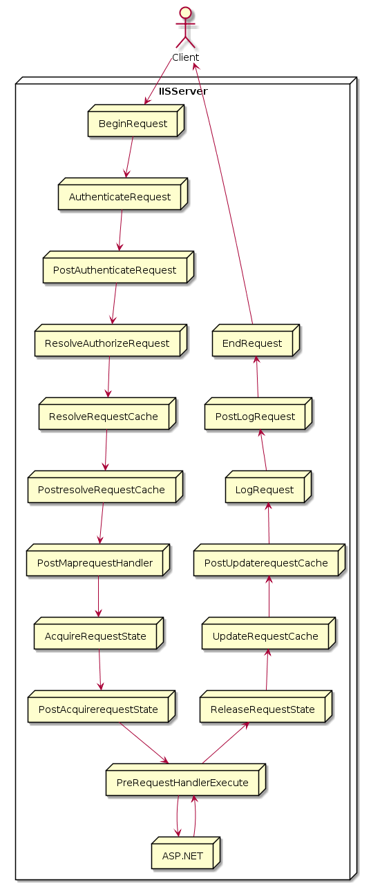

Day10-1
kkkkkkkkkkkkkkkkkkkkkkkkkkkkkkkkkkkkkkkkk
===

# 概要

Global.asaxでエラー処理を記述しよう！

## このレッスンの狙い

- `Global.asax`は、アプリケーション内で発生したイベントを処理するためのファイルである。
- `Global.asax`を利用することで、アクセスログやエラー情報、独自の認証処理、アプリケーション/セッション共通で利用可能なオブジェクトの定義を行うことが可能になる。

## `Global.asax`とは？

- Global.asaxはグローバルアプリケーションファイルとも呼ばれ、アプリケーションで発生する各種イベント(アプリケーションイベント)を処理したり、アプリケーション/セッション共通で利用可能なオブジェクトの宣言を行ったりするために使用する。
  - 共通の処理を記述するためのファイル。
- ファイル名は*Global.asax*固定で、変更することができない。
- `Web.config`とは異なり、必ずアプリケーションルートの直下に配置しなければならない。

### Global.asaxで利用可能なアプリケーションイベント

- Global.asaxで利用可能なイベント

#### 分類: 条件

イベントハンドラ|概要
----------------|----
`Application_Start`|アプリケーションが初回起動した一回のみ発生
`Session_Start`|ユーザセッションが初回起動した1回のみ発生<br>※ セッション変数などを初期化するためなどに使用
`Session_End`|ユーザセッションがクローズしたタイミングで発生<br>※ セッション変数にプールされた情報をDBなどに最終的に保存するために使用する。
`Application_End`|アプリケーションが破棄されたタイミングで発生<br>※ アプリケーション変数にプールされた情報をDBなどに最終的に保存するために使用する。
`Application_Error`|アプリケーション内で処理されない例外(エラー)が発生した場合に発生<br>※エラーログの記録や管理者への通知、エラーページの生成などのために使用

#### 分類: リクエスト

イベントハンドラ|概要
----------------|----
`Application_BeginRequest`|HTTPハンドラがリクエスト処理を開始する前に発生
`Application_AuthenticateRequest`|認証の準備ができたタイミングで発生<br>※ 独自の認証機能を構築したい場合に利用
`Application_PostAuthenticateRequest`|ユーザ認証が完了したタイミングで発生
`Application_AuthorizeRequest`|ユーザが認定されるタイミングで発生
`Application_PostAuthorizeRequest`|ユーザの認定が完了したタイミングで発生
`Application_ResolveRequestCache`|リクエストを、*キャッシュ処理*するタイミングで発生
`Application_PostResolveRequestCache`|ASP.NETがキャッシュからの処理を許可した場合に発生
`Application_PostResolveRequestHandler`|要求が適切なイベントハンドラにマップされたタイミングで発生
`Application_AcquireRequestState`|リクエストに関連づいた状態(セッション状態など)を取得するタイミングで発生<br>※ 独自のセッション管理を行いたい場合に利用
`Application_PostAcquireRequestState`|リクエストに関連づいた状態を取得し終えたタイミングで発生
`Application_PreRequestHandlerExecute`|HTTPハンドラがページの実行を開始する直前に発生
`Application_PostRequestHandlerExecute`|HTTPハンドラがページの実行を開始する直後に発生
`Application_ReleaseRequestState`|すべての実行を完了したタイミングで発生
`Application_PostReleaseRequestState`|リクエストに関連づいた状態をストアに保存し終えたタイミングで発生。<br>※ 本イベントのタイミングで、出力のフォルダ処理なども行われる。
`Application_UpdateRequestCache`|操作完了後に発生(出力キャッシュを更新)
`Application_PostUpdateRequestCache`|出力キャッシュの更新を完了したタイミングで発生。
`Application_LogRequest`|要求に対するログの記録処理に先立って発生。
`Application_PostLogRequest`|要求に対するログの記録処理が完了したタイミングで発生。
`Application_EndRequest`|すべてのリクエスト処理が完了したタイミングで発生。
`Application_PreSendRequestHeaders`|HTTPヘッダーをクライアントに送信する直前に発生。
`Application_PreSendRequestConten`|HTTPコンテンツをクライアントに送信する直前に発生。

#### アプリケーションイベントの発生順序

- アプリケーションイベントは以下のような順序で発生する。



### ファイルへの書き込み方法について

- 参考書の例では、`Application_Error`イベントを使用して、アプリケーションで発生したエラー情報を`error.log`に保存していた。
- ファイルへの書き込みを行うには、`StreamWriter`クラスを使用する。

#### `Stream.Writer`クラス

##### 構文

	public StreamWriter(string path, bool append, Encoding encoding);

```C#:使用例

  Using StreamWriter writer = new StreamWriter(filePath, false, Encoding.GetEncoding("shift_jis"));
	...
	End Using

```

- 第二引数を`False`に設定した場合、`StreamWriter`クラスは書き込みごとにファイルをクリアする。
- 文字コーディングは、`Encoding.getEncoding("文字コード名")`で取得することが可能。

#### `StringBuilder`クラス

- `String`は固定長の文字列を表す。
- `StringBuilder`クラスは可変長の文字列を表す。
- 繰り返し文字列を連結する超なケースでは、`StringBuilder`オブジェクトを利用することで、アプリケーションの処理パフォーマンスを向上することができる(かもしれない)。

#### `Server.GetLastError`メソッド

- 直前に発生した例外情報を`Exeception`オブジェクトで返す。
- `Exception`クラスで利用可能なプロパティは下記の通り

プロパティ|概要
----------|----
HelpLink|例外に関連付けられているヘルプファイルのURL
InnerException|現在の例外の原因となったExcetptionオブジェクト
Message|例外に関する詳細情報
Source|例外の原因となったアプリケーションまたはオブジェクト名
stackTrace|例外に関するスタックトレース

### カスタムのエラーページの定義

- アプリケーションで定義されない例外が発生した場合に表示されるエラー通知画面のこと
- `localhost`経由で接続されているエラー画面は、詳細なエラーメッセージやエラー発生までの実行トレース、エラー発生元のソースコードなどをすべて表示する。
- 一方、サーバに対してリモート接続されているユーザに対しては、実行トレース、エラー発生元のソースコード等の詳細な情報は表示しない
  - エンドユーザ向けのカスタムエラー画面を提供するには、アプリケーションファイル(`web.config`)から`<customErrors>`要素を指定する。

#### <customErrors>要素

```ASP.NET:<CustomErrors>要素の構造

<customErrors mode="{On|Off|RemoteOnly}" {defaultRedirect="リダイレクト"]>
	[<error statusCode="HTTPエラーステータス" redirect="リダイレクト先" />]
<customErrors>

```

- mode属性の設定値

設定値|概要
------|----
On|カスタムエラーが有効、`defaultRedirect`属性が未指定の場合には、一般ユーザ用の標準エラーを表示
Off|カスタムエラーが無効。「常に」詳細な開発者用のエラー表示します。
RemoteOnly|リモート接続のユーザに対してのみカスタムエラー画面を表示、ローカル接続のユーザに対しては詳細な開発者用エラー画面を表示

## まとめ

[TOPへ](./index.md)  
