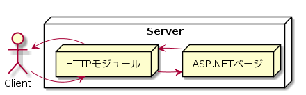

Day10-2
===

# 概要

- HTTPモジュールでアクセス情報をログに記録しよう！

## このレッスンの狙い

- htttpモジュールの特徴と使用方法を学習する。

### HTTPモジュールとは

- リクエスト処理に特定の機能を追加するために役割を提供するもの
- ページを生成する際に同時に呼び出され，「補助的な」処理を行うもの
  - 独自の認証/エラー処理や生成されたコンテンツの圧縮，あるいは，アクセスログなどの処理
- `aspx`や`Global.asax`に直接組み込む場合に比べて，高い保守性や柔軟な配置を実現可能。



- HTTPモジュールを利用する際は，構成ファイルに定義を追加するだけであるため，アプリケーション本体に変更を加える必要はない
- `Global.asax`と`HTTPモジュール`の違いは，前者はルート直下にひとつしか配置することができないのに対して，後者はさまざまな処理を複数のファイルに分けて実現することが可能。

### HTTPモジュールの記述の仕方

#### コード

```VB.NET:コード

Imports Microsoft.VisualBasic
  ...中略...
Public Class LoggingModule : Implements IHttpModule
  Public Sub Init(ByVal Application As HttpApplication) Implemets IHttpModule.Init
	  ...初期化処理...
	End Sub
  ...中略...
	Public Sub Dispose() Implements IHttpModule.Dispose
	  ...終了処理
	End Sub
End Class

```

#### 解説

##### 1. IHttpModuleインターフェースを実装すること

- `IHttpModule`インターフェースは，HTTPモジュールの基本的な機能を定義したインターフェースである。
- すべてのHTTPモジュールクラスは必ず，`IHttpModule`インターフェースを実装する必要がある。
- インターフェースを実装するには，`Implements`キーワードを使用する。
  - 個々のメンバにも`Implements インターフェース名.メソッド名`の形式で，実装するメンバを明示的に指定する必要がある。

##### 2. Init/Disposeメソッドを定義すること

- `IHttpModule`インターフェースには，以下のメソッドが定義されている。

メソッド名|呼び出しのタイミング|用途
----------|--------------------|----
Init|アプリケーション起動時|リソースの確保やイベント処理の追加
Dispose|アプリケーション終了時|リソースの解放など

- イベントとイベントハンドラの関連付けは，下記のように`AddHandler`命令で行うことができる。

````VB.NET:AddHandler命令の構文と例

構文
AddHandler イベント名 AddressOf Me.ハンドラ名

例)
AddHandler Application.BeginRequest,AddressOf Me.Application_BeginRequest

```

#### 3. App_Codeフォルダに配置すること

- `.vb`や`.cs`などのビジネスロジックを記述したコードは，アプリケーションフォルダ`App_Code`に配置する必要がある。
- `App_Code`に配置されたコードはアプリケーションの実行時に自動的にコンパイルがされる。

#### HTTPモジュールを起動する

- HTTPモジュールは，*"あるページが呼び出されたときに合わせて呼び出される"*という性質上，`aspx`ファイルのように，URLやHTMLフォームなどから直接呼び出すことができない。
- そのため，HTTPモジュールを起動するには，`web.config`でHTTPモジュールを*登録*しておく必要がある。

```ASP.NET:HTTPモジュールの登録

<httpModules>
  ...中略...
	<add name="LoggingModule" type="LoggingModule" />
</httpModules>

```

- `<httpModules>`要素配下では，登録するHTTPモジュールを`<add>`要素で宣言することが可能
  - `<add>`要素で利用可能な主な属性は，以下の通り

属性|概要
----|----
name|モジュールの表示名，任意の文字列を指定できるが，アプリケーション内で一意でなければならない
type|Httpモジュールの型。

## まとめ

- HTTPモジュールは，リクエスト処理に特定の機能を追加するための役割を提供する。
- HTTPモジュールは，独自の認証/エラー処理や，生成されたコンテンツの圧縮，アクセスログなど，付随的な処理を定義するために使用する。
- HTTPモジュールは，`IHttpModule`インターフェースを実装する必要がある。
  - `Init`メソッドで，イベントハンドラの登録やリソースの確保処理を行う。
  - `Dispose`メソッドで，リソースの解放処理などを行う。
- HTTPモジュールは，`Web.config`の`<httpModules>`要素で登録する必要がある。

[TOPへ](./index.md)  
